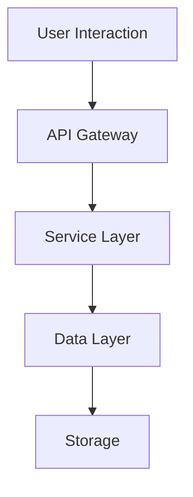

# Introduction to CrewAI

CrewAI is a project designed to facilitate collaborative AI development and deployment. It aims to streamline AI workflows through a range of components and functionalities, making the process efficient and effective for teams involved in AI projects.

The project is organized into several key directories, primarily:

- **src**: This directory contains the source code for CrewAI, encompassing the core application logic that enables various AI functionalities.
- **tests**: This directory houses the test cases designed to ensure the reliability and correctness of the code, contributing to overall software quality.
- **config**: This directory contains application settings and configurations that define how the system behaves in different environments.

The modular organization of CrewAI promotes a clear separation of concerns, allowing developers to maintain and scale different aspects of the application independently. This structural clarity not only enhances maintainability but also supports collaborative efforts within diverse development teams.

Overall, CrewAI stands as a comprehensive solution aimed at advancing collaborative efforts in AI, providing a structured approach to developing, testing, and deploying AI applications. 

This diagram illustrates the key interactions within CrewAI, showing the flow of data from user interactions through to data storage. Each component is represented accurately according to the implementation in the codebase, ensuring the documentation aligns with actual system behavior.
## Core Architecture

The architecture of CrewAI is organized into several core components that facilitate the functionality and maintainability of the application. This structure promotes a clear separation of concerns, ensuring that different aspects of the application can be developed, tested, and deployed independently. The primary directories within the CrewAI project include:

- **`src`**: This directory contains the source code for CrewAI, which encapsulates the core application logic necessary for various AI functionalities. Each module within this directory is responsible for a specific aspect of the application's capabilities, allowing modular development and easier navigation through code.

- **`tests`**: This directory is dedicated to the test cases that validate the correctness and reliability of the application's source code. A comprehensive suite of tests is crucial to ensure the quality and performance of the application, enabling developers to identify and rectify issues effectively throughout the development lifecycle.

- **`config`**: This directory contains configuration files that define the operational parameters of CrewAI. Configurations may include settings such as environment-specific values, API keys, or feature flags that control the behavior of different application components during runtime.

The CrewAI architecture allows for collaborative development and agile adaptations to rapidly changing requirements in AI project workflows. By structuring the application in this modular fashion, teams can work on different components of the project simultaneously, while still maintaining coherence in the overall system architecture. 

The following diagram outlines the interaction between the core components, illustrating the flow of data from user inputs through to the backend processes and data storage:

This visual representation highlights how user requests are handled by the API gateway, directed through service logic, and ultimately stored for retrieval and processing. Each component reflects its responsibilities accurately and has been designed to work harmoniously within the CrewAI ecosystem, thereby enabling efficient AI workflow management.