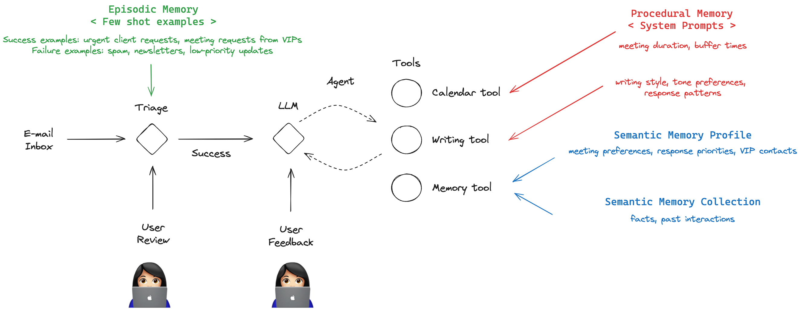

Long-Term Memory with LangGraph - Harrison Chase (CEO of lang chain)

* LLM Memory gives context for long term
* Memory is namespaced key value store

Workshops focussed on creating email assistant:
1. Without any memory
2. With sematic memmory
3. With Semantic and episodic memory
4. With Procedural memory

Workshop : https://learn.deeplearning.ai/courses/langchain-314-workshop